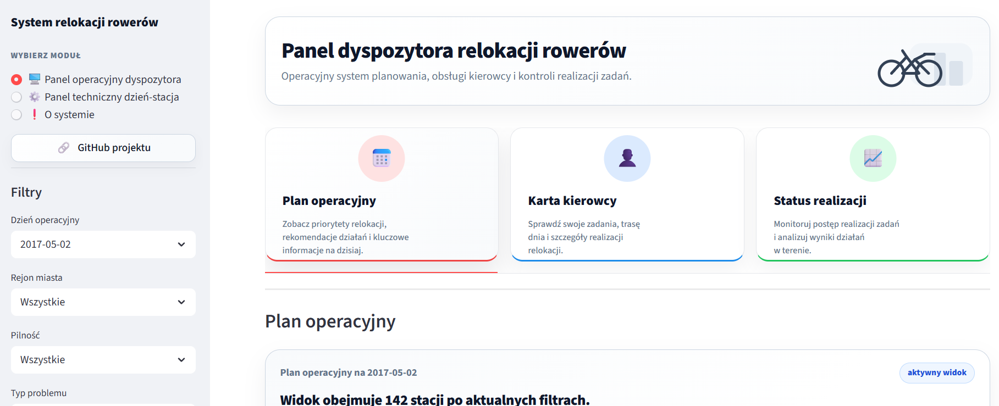
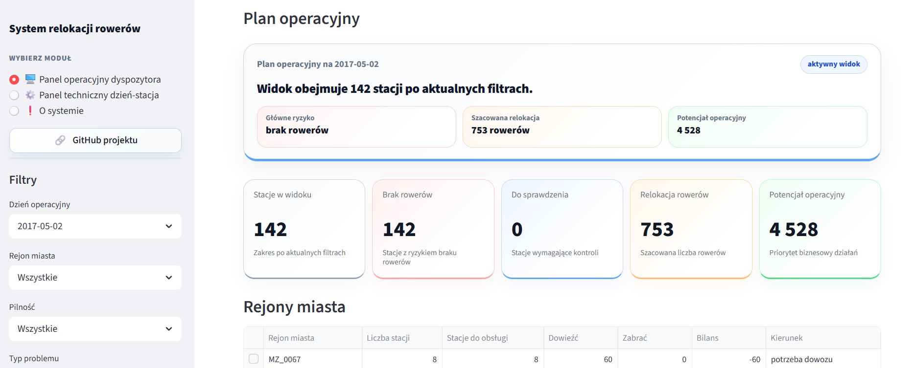
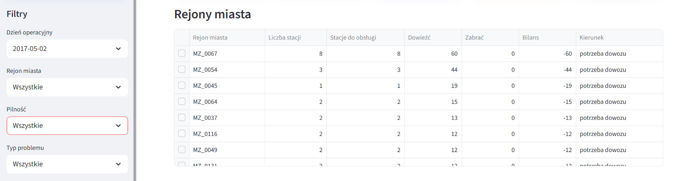
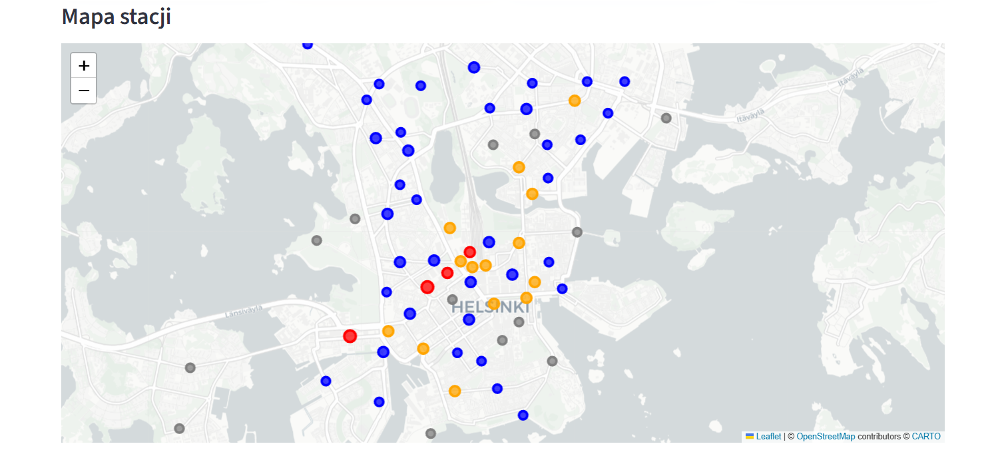
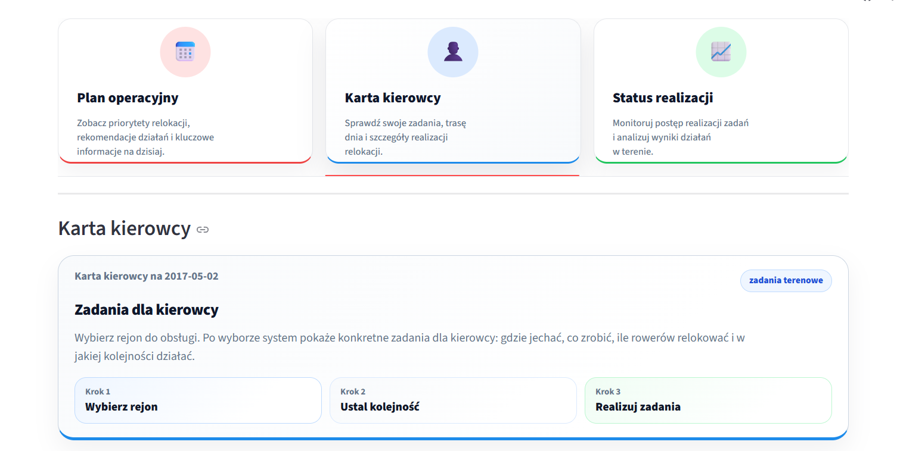
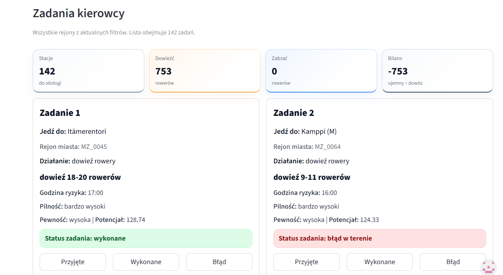

# AI-Driven Bike Fleet Relocation System


End-to-end Machine Learning and operational analytics system for predicting daily bike station risk and supporting bike fleet relocation decisions in a smart city environment.

## Live Application

🚴 [Open Live Streamlit Application](https://robert-basinski-system-relokacji.streamlit.app/)

## Application Preview

### Operational Dashboard



### Operational Plan KPIs



### Microzone Operations



### Station Map View



### Driver Card Module



### Execution Status Dashboard



## Project Overview

This project combines:

- Machine Learning risk scoring
- Operational decision support
- Smart city analytics
- Streamlit dashboard application
- Dispatcher operational panel
- Technical station monitoring
- Geospatial visualization with Folium
- Forecast-based bike relocation planning

The system predicts station-level operational risk and supports dispatchers in daily relocation planning.

## Project Highlights

- End-to-end Machine Learning and operational analytics platform
- Real operational dispatcher workflow simulation
- Integrated technical and operational dashboard architecture
- Time-based validation and anti-leakage ML workflow
- LightGBM-based station risk classification
- Geospatial operational monitoring with Folium
- Streamlit production-style application layer
- Operational KPI aggregation and recommendation system
- Multi-layer parquet artifact architecture
- Smart-city operational decision support system

## Main Features

### Operational Dispatcher Panel

- Daily operational plan
- Station priority ranking
- Risk categorization
- Recommended relocation actions
- Microzone operational view
- Interactive city map
- Driver support card
- Operational status monitoring

### Key Operational Capabilities

- Operational bike relocation planning
- Risk-based station prioritization
- Microzone balancing strategy
- Forecast-supported operational recommendations
- Dispatcher decision support
- Driver execution workflow
- Interactive operational monitoring
- Geospatial operational visualization
- Real-time style operational dashboard
- Operational KPI aggregation

### Technical Monitoring Panel

- Station-level diagnostics
- Risk scoring inspection
- Prediction analysis
- Technical validation layer
- Feature-based operational insights

## Machine Learning Workflow

The project includes:

- Data preprocessing pipeline
- Feature engineering
- Anti-leakage validation
- Classification modeling
- Time-based validation
- LightGBM optimization
- Business-oriented evaluation
- Operational deployment layer

## Technology Stack

## Core Technologies

- Python 3.12
- Streamlit
- LightGBM
- Pandas
- Scikit-learn
- Folium
- Plotly
- Parquet
- GitHub Actions ready architecture

### Machine Learning & Analytics

- Python
- Pandas
- NumPy
- Scikit-learn
- LightGBM

### Visualization & Application

- Streamlit
- Folium
- Plotly
- Matplotlib

### Data & Engineering

- Parquet
- Jupyter Notebook
- GitHub
- Streamlit Cloud

## How to Run Locally

```bash
git clone https://github.com/robert-basinski/system-relokacji-rowerow.git
cd system-relokacji-rowerow
pip install -r requirements.txt
streamlit run app/app_main.py
```

The application uses prepared model and operational artifacts stored in the repository.

## Repository Structure

```text
app/
├── app_main.py
├── 1_Panel_Dyspozytora.py
└── 2_Panel_Techniczny.py

notebooks/
├── 1_EDA_Preprocessing.ipynb
├── 2_Time_Series_Analysis.ipynb
├── 3_Model_Training.ipynb
├── 3_1_Model_Optimization.ipynb
├── 4_Deployment_Pipeline.ipynb
├── 5_Application_Layer.ipynb
└── 6_Dispatcher_System.ipynb
docs/
└── screenshots/

artifacts/
└── 3_feature_screening/

app_runtime/
outputs_dzien_stacja/
outputs_panel_dyspozytora/
input_model_package/
requirements.txt
README.md
```
## System Architecture

👉 Full architecture diagram: [View System Architecture](docs/architecture/system_architecture.md)

The project is divided into several operational and Machine Learning layers:

### Data Layer
- Aggregated station analytics
- Operational parquet datasets
- Forecast and weather integration
- Historical station behavior profiles

### Machine Learning Layer
- Feature engineering
- Anti-leakage validation
- Classification modeling
- LightGBM optimization
- Time-based validation

### Operational Layer
- Dispatcher operational planning
- Station prioritization
- Relocation recommendations
- Driver task management
- Execution monitoring

### Application Layer
- Streamlit operational dashboard
- Technical monitoring panel
- Interactive geospatial visualization
- Operational KPI reporting

## Business Goal

The goal of the project is to support operational bike fleet management in urban environments by combining Machine Learning predictions with operational decision-support tools.

## Author

Robert Basiński
